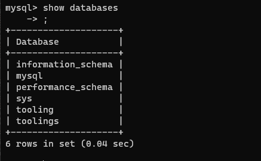

## **DevOps Tooling Website Architecture**

In this project we will be hosting a devops website in webservers as shown in the architecture below.


To go about this we will prepare a Network File System Server (NFS Server) where we will attach 3 AWS volumes to the server instance using Logical Volume Management. Next we will configure a database sever which will work with 3 web servers.

 **A --PREPARE NFS SERVER**

 1. We will spin up an EC2 instance with RHEL OS. We will configure 3 volumes and attache them to the NFS instance where we will configure a logical volume.

2. We will format the disk as `xfs` and name the logical volumes as lv-opt, lv-apps and lv-logs as shown below.


Mount lv-apps on /mnt/apps – To be used by webservers
Mount lv-logs on /mnt/logs – To be used by webserver logs
Mount lv-opt on /mnt/opt – To be used by Jenkins


3. Next we will install NFS Server, enable and start the service using the below codes.

``````
sudo yum -y update
sudo yum install nfs-utils -y
sudo systemctl start nfs-server.service
sudo systemctl enable nfs-server.service
sudo systemctl status nfs-server.service
``````

We need to confirm if the NFS Server service is working


4. We have to make sure that permissions are set up properly on the NFS server so that our web servers can read to, write to and execute files on the NFS.

``````
sudo chown -R nobody: /mnt/apps
sudo chown -R nobody: /mnt/logs
sudo chown -R nobody: /mnt/opt

sudo chmod -R 777 /mnt/apps
sudo chmod -R 777 /mnt/logs
sudo chmod -R 777 /mnt/opt

sudo systemctl restart nfs-server.service
``````
Now, we will configure access to NFS for clients within the same subnet.

``````
sudo vi /etc/exports
/mnt/apps 172.31.32.0/20(rw,sync,no_all_squash,no_root_squash)
/mnt/logs 172.31.32.0/20(rw,sync,no_all_squash,no_root_squash)
/mnt/opt  172.31.32.0/20(rw,sync,no_all_squash,no_root_squash)

Esc + :wq!

sudo exportfs -arv
``````
5. Next we check which port is used by NFS and open it using secuity goup. 


 **B --CONFIGURE THE DATABASE SERVER**

 1. We will install and configure the MYSQL DBMS to work with the remote web server.

 ``````
    sudo yum install mysql-server -y
	sudo systemctl start mysqld
	sudo systemctl enable mysqld
 ``````
2. Create a database name it tooling. Create a database user and name it webaccess. Grant permission to webaccess user on tooling database to do anything only from the webservers subnet CIDR.

``````
    sudo mysql
	CREATE DATABASE tooling;
	CREATE USER `webaccesss`@`172.31.32.0/20` IDENTIFIED BY 'password';
	GRANT ALL ON tooling.* TO 'webaccesss'@'172.31.32.0/20';
	FLUSH PRIVILEGES;
	Show databases;
``````



`select user, host from mysql.user` --- show you a table of users and it host


**C --PREPARE THE WEB SERVERS**

